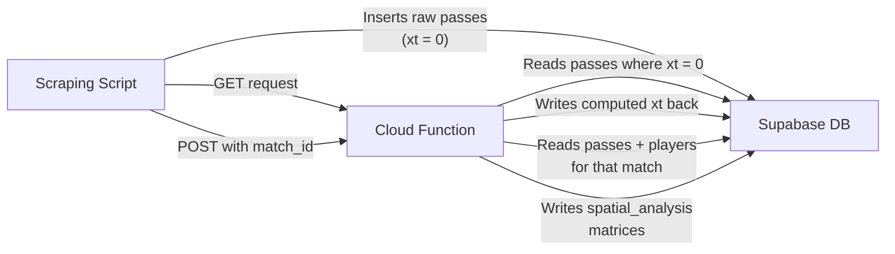

# Cloud Function Architecture — xT Calculation Engine

## Overview

We use a single **Google Cloud Function** (`calculateTxPerPas`) deployed on Cloud Run that acts as a serverless computation engine. It connects to a **Supabase** (PostgreSQL) database to read raw pass data, compute Expected Threat (xT) values, and write enriched results back. The function exposes two operational modes through the same HTTP endpoint, selected by request method.

---

## Data Flow

---

## What Happens on Cloud

The Cloud Function has **two modes**, routed by HTTP method:

### Mode 1: xT Calculation per Pass (`GET` request)

**Trigger:** A simple GET request to the function URL (no body needed).

**Process:**
1. Connects to Supabase using environment variables (`SUPABASE_URL`, `SUPABASE_SERVICE_ROLE_KEY`).
2. Queries the `passes` table for all rows where `xt = 0` or `xt IS NULL` (unprocessed passes), in batches of 1,000 rows, up to a maximum of 5,000 per invocation.
3. For each pass, maps the start and end coordinates (on a 0–100 scale) onto a **16×12 Expected Threat grid** — a pre-computed probability matrix derived from football analytics research that represents the likelihood of scoring from each zone on the pitch.
4. Computes **xT gain** = `xT(end zone) − xT(start zone)`, clamped to a minimum of 0 (backward passes yield no positive threat).
5. If the computed xT gain is exactly 0, stores `0.00000001` instead — a sentinel value that distinguishes "calculated but zero threat" from "not yet calculated" (`0`), preventing the function from reprocessing the same passes on subsequent runs.
6. Upserts the results back into the `passes` table (matched on `id`).

### Mode 2: Spatial Analysis (`POST` request with `match_id`)

**Trigger:** A POST request with JSON body `{ "match_id": "<id>" }`.

**Process:**
1. Fetches all **players** for the given match from the `players` table (to map each player to their team).
2. Fetches all **passes** for that match that have already been processed (xT ≠ null).
3. Initializes a blank **12×16 matrix** (filled with zeros) for every player and every team in the match.
4. For each pass, determines which grid cell the pass **originated from** (using `x_start`, `y_start`), then accumulates the pass's xT value into the corresponding cell of both the player's matrix and their team's matrix.
5. For each matrix, computes:
   - **`total_xt_value`** — the sum of all cells (total threat generated).
   - **`max_xt_zone_id`** — the cell index (0–191) with the highest accumulated xT (the player's/team's most dangerous zone).
6. Upserts all results into the `spatial_analysis` table, keyed on `(match_id, entity_id)` to prevent duplicates on re-runs.

---

## What We Calculate

| Metric | Description | Stored In |
|---|---|---|
| **xT per pass** | The threat gain of a single pass, derived from a 16×12 probability grid. Measures how much closer to a goal-scoring opportunity the pass moved the ball. | `passes.xt` |
| **Spatial xT matrix (player)** | A 12×16 heatmap of accumulated xT values showing *where on the pitch* a player generates offensive threat. | `spatial_analysis.xt_matrix` (type = PLAYER) |
| **Spatial xT matrix (team)** | Same heatmap aggregated across all players of a team — shows the team's collective attacking patterns. | `spatial_analysis.xt_matrix` (type = TEAM) |
| **Total xT value** | Sum of all xT contributions by a player or team in a match. | `spatial_analysis.total_xt_value` |
| **Most dangerous zone** | The single pitch zone (cell index 0–191) where the entity generates the highest threat. | `spatial_analysis.max_xt_zone_id` |

---

## Tech Stack

- **Runtime:** Node.js 24 on Google Cloud Functions (2nd gen / Cloud Run)
- **Database:** Supabase (PostgreSQL) with Row-Level Security
- **Communication:** Supabase JS Client (`@supabase/supabase-js`) over HTTPS
- **Entry Point:** `calculateTxPerPas` — single function, dual-mode routing
